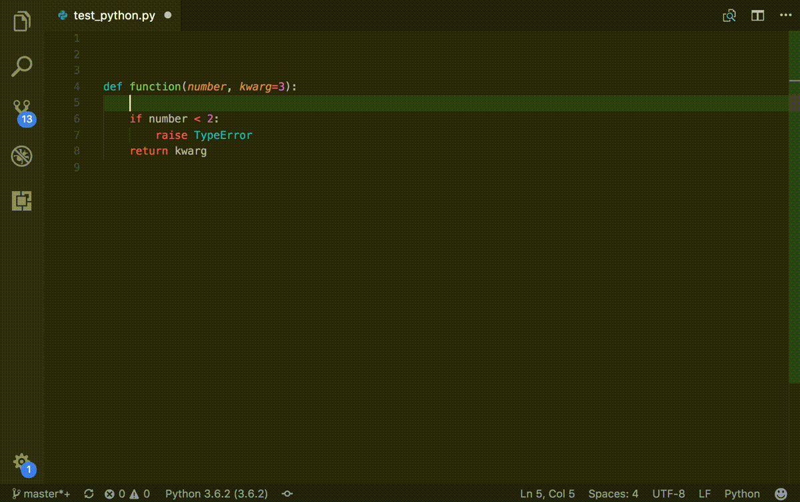
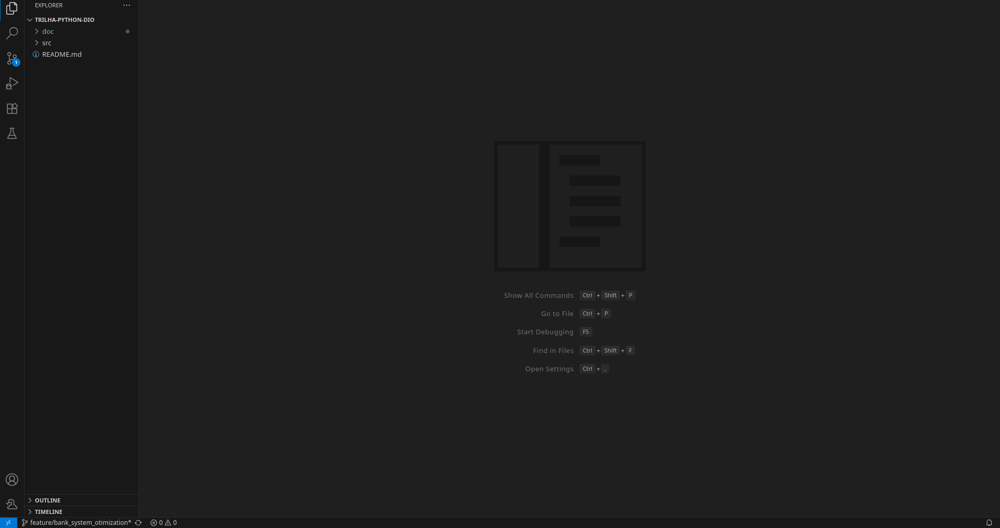
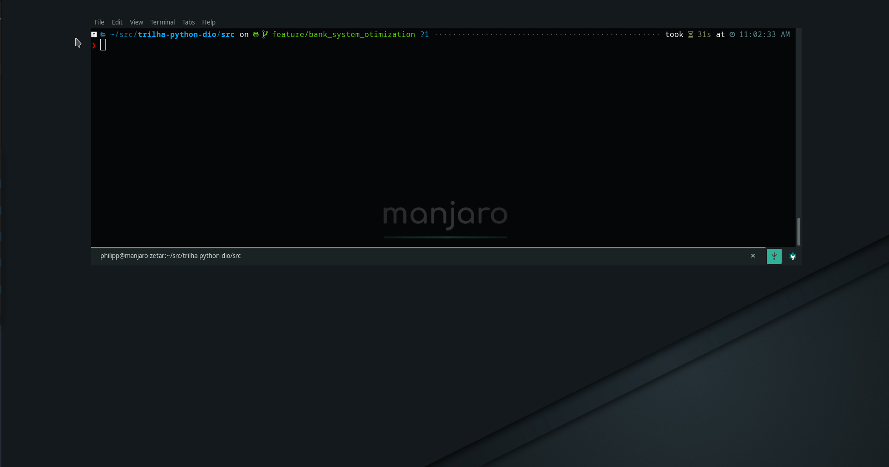
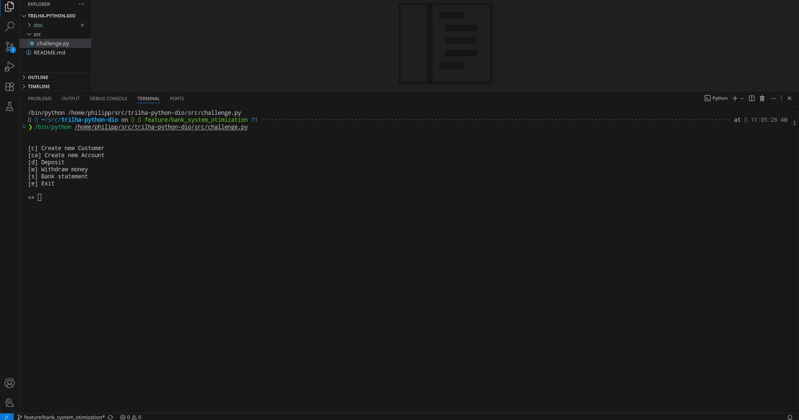
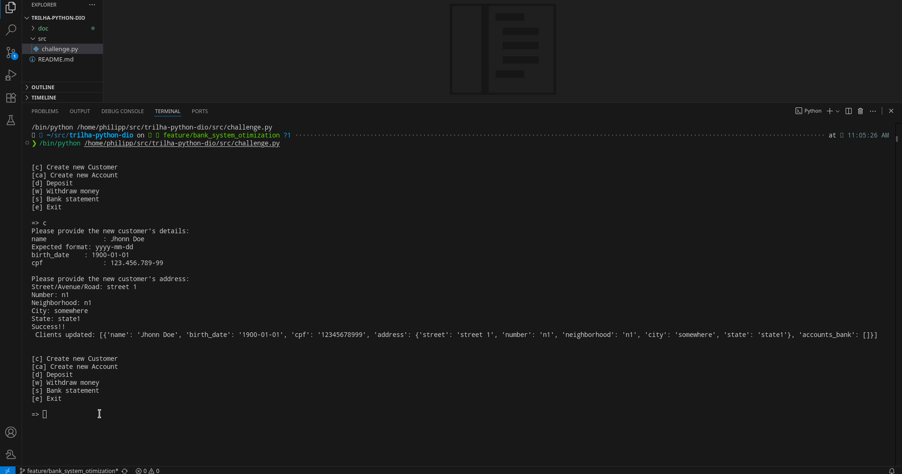
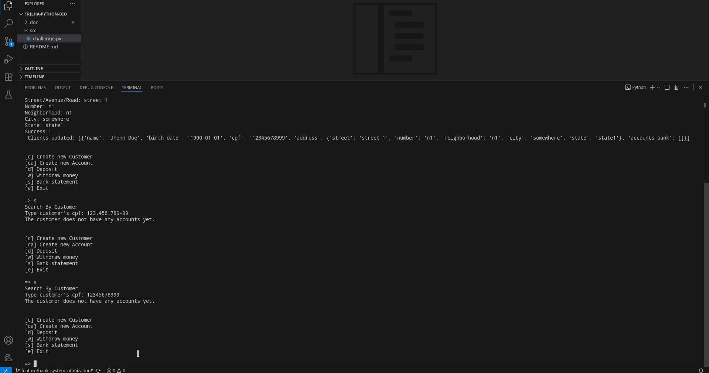
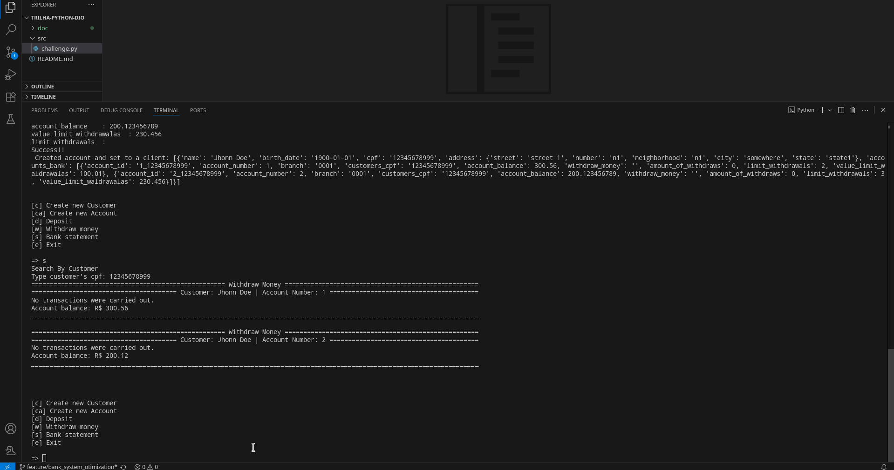
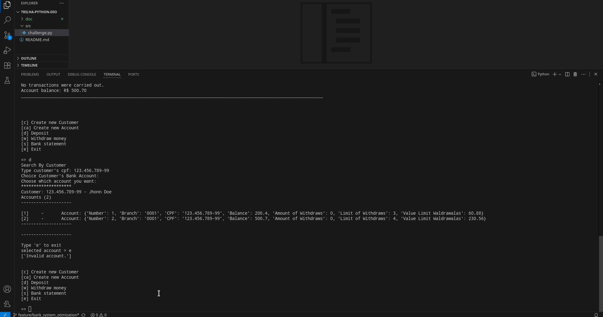

# Trilha Python [DIO](https://github.com/digitalinnovationone)

## Introdução

Este repositório, tem como objetivo, em contexto de aprendizado, demonstrar conceitos básicos usados na programação com linguagem Python.

Esta branch em especifíco, contempla aplicação prática dos conceitos demonstrados durante o Bootcamp [Luizalabs - Back-end com Python](https://web.dio.me/track/luizalabs-back-end-com-python) realizado pela [DIO](https://github.com/digitalinnovationone) + [Luizalabs](https://www.linkedin.com/company/luizalabs/):
  - Tipos de dados primitivos (números, textos)
  - Tipos de dados para lidar com cadeia de dados do mesmo tipo, como tuplas, dicionários
  - Estrutura básica de um programa python
  - Estrutura e escopo de uma função

## Tecnologias

-  Python
-  Markdown
-  Documentação do código usando [autoDocstring](https://github.com/NilsJPWerner/autoDocstring)


## Objetivos

A proposta deste repositório, era a de explorar os recursos básicos da lingaugem, porém, provendo certa segregação do código.
Desta forma, apesar de não ter optado pela abordagem de módulos, foi aplicado no código:
- Melhor nomenclatura possível, facilitando o entendimento conceitual de cada variavel, seja ela de processamento, parâmetro de entrada ou parâmetro de retorno
- Não sobrecarga de funções com escopo além do necessário, assim, pode se perceber, funções responsáveis pela criação de entidades do dominio de negócio (sistema bancário),
funções com responsabilidade unicamente de prover a interação com o usuário para captura de dados necessários para o fluxo funcional do sistema
- Criado documentação básica, que prove um entendimento complementar do objetivo das funções criadas, quando somente seu nome não for suficiente para prover ao desenvolvedor um
entendimento do seu objetivo

>>> Sim há pontos que poderiam e com certeza ficariam melhores, se aplicado o conceito de tratamento de erro, visando lidar com possíveis inputs do usuário, que não esperado pelo programa,
porém, novamente, **reforço** que até este momento, mantive o código simples, bem compartimentado e limitado ao fluxo de conhecimento do bootcamp que obtive do mundo python.

## Como executar

- Clone o repositório para sua máquina
- Usando o Visual Studio Code


- Via terminal de comando (shell)

```shell
python3 challenge.py
```



## Funcionalidades

>> A evolução do estado inicial do código, pode ser acompanhada conforme [Issues](https://github.com/philipp-moreira/trilha-python-dio/issues?q=is%3Aissue%20state%3Aclosed) criadas

1 - Criar Cliente


2 - Exibir extrato de operações do Cliente


3 - Criar uma conta bancária


4 - Fazer operação de depósito


5 - Fazer operação de saque

